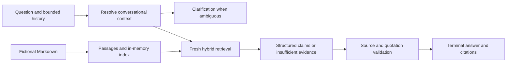

# Applied LLM RAG System

**Scott Allen · AI engineering portfolio**

Finding a document is only part of answering a question. A useful assistant also has to choose the right passage, show where its answer came from, and handle the next question when the user leaves half of it unsaid.

This independent project demonstrates retrieval-augmented question answering over fictional institutional policies. Its terminal application combines semantic and keyword retrieval, conversational context resolution, and quoted source citations. It is informed by professional experience with institutional RAG systems; the implementation and sample material are independent of employer systems.

## The conversational challenge

Consider two conversations that end with the same question:

> “Who approves an overnight trip?”
>
> “Does that change for part-time staff?”

> “Who can receive tuition assistance?”
>
> “Does that change for part-time staff?”

The follow-up must recover a different subject in each conversation and retrieve the relevant evidence again. If the preceding exchange covers multiple policies, an ambiguous reference should prompt clarification. An explicit topic change should start a fresh search.

The demo implements those distinctions with bounded conversation history and fresh retrieval. The [design case study](docs/CASE_STUDY.md) explains the decisions, including why a cache keyed only by the latest question would be unsafe for contextual follow-ups.

## Engineering decisions

- **Hybrid retrieval:** combine cosine similarity and distinct keyword-overlap rankings with reciprocal rank fusion, preserving both semantic matches and exact policy terms.
- **Inspectable sources:** split Markdown into bounded passages with stable source identifiers, section names, and line references.
- **Grounded output:** require structured claims with retrieved source IDs and exact evidence quotations; reject invalid citations before displaying an answer.
- **Explicit uncertainty:** request clarification for unresolved references and report insufficient evidence when the documents do not answer the question.
- **Failure recovery:** bound provider requests and preserve completed conversation history when a turn fails.
- **Reproducible execution:** pin the Node runtime and run credential-free tests in GitHub Actions, using only Node built-ins.

## Architecture



OpenAI supplies embeddings and generation. GPT-5.6 Terra is the default generation model; `DEMO_MODEL=gpt-5.6-luna` selects Luna. Embeddings use `text-embedding-3-small`. The in-memory index keeps retrieval visible without a separate database and is rebuilt on startup. See the [architecture notes](docs/ARCHITECTURE.md) for implementation details and tradeoffs.

## Run the demo

Use Node.js 24.21.0 from `.nvmrc`. No npm dependency installation is required.

```sh
# Validate the runtime, fictional corpus, and case manifests.
npm run check

# Run offline tests without credentials.
npm test

# Ask a question using hosted OpenAI inference.
npm run demo -- "Who approves an overnight trip?"

# Start an interactive conversation.
npm run demo
```

Chat requires an existing `OPENAI_API_KEY` and incurs API usage charges. The [setup guide](docs/LOCAL_DEMO.md) covers configuration, local credential exclusions, interactive commands, and live scenario checks.

## Verification

All **65 offline tests** pass on the pinned runtime in both the working checkout and a clean copy without credentials or installed packages. They cover runtime and provider contracts, retrieval, citations, conversation recovery, the versioned corpus, case schemas, source labels, and split isolation. GitHub Actions runs the offline suite and CLI help check; hosted verification of this dataset revision remains pending publication.

Ten focused live scenarios passed for each of Terra and Luna on 2026-09-12 after the documented resolver and checker corrections. Each final claim was independently inspected against its evidence quote. The [verification record](docs/LOCAL_DEMO.md#terra-and-luna-verification) preserves initial failures and distinguishes raw results from corrected-checker replays.

Those historical results are known development cases, not a held-out benchmark. The expanded dataset contains ten fictional documents, 38 stable-ID passages, 21 development turns, and a structurally separate eleven-turn held-out suite that has not been run. Exact quotation checks establish source membership but do not prove that a quote supports its claim. The [evaluation methodology](docs/EVALUATION.md) and [limitations](docs/LIMITATIONS.md) describe those boundaries without making general accuracy, latency, or cost claims.

## Repository scope

The runnable application lives in `demo/`, with the versioned invented dataset in `sample-data/fictional/` and its case manifests in `evaluation/fictional/`. The original `src/` and `python/` directories contain separate document-processing, ingestion, retrieval, cache, feedback, and streaming examples. They are not integrated into the demo; the [feature matrix](docs/FEATURE_STATUS.md) distinguishes their implementation and verification boundaries.

Use the fictional corpus for the demonstration. The original ingestion and cloud-processing examples can make remote changes and need the safeguards described in the [security notes](docs/SECURITY.md) before use with real services.

The [provenance policy](DISCLAIMER.md) explains the project's independent scope and public-material boundaries. No standalone license grant is included. Security reporting guidance is in [SECURITY.md](SECURITY.md).
