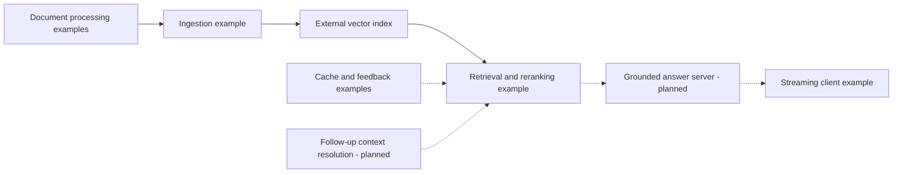

# Applied LLM RAG System

**Scott Allen · AI engineering portfolio**

Finding a document is only part of answering a question. A useful assistant also has to choose the right passage, show where its answer came from, and handle the next question when the user leaves half of it unsaid.

This independent reference project explores those problems through document processing, retrieval, caching, feedback, and streaming chat. It is informed by professional experience with institutional RAG systems. The showcase describes engineering choices in original prose; it is not a reproduction of an employer's production system.

**Current state:** an independent Phase 3 terminal RAG demonstration now accompanies the original component examples and audited design. The demo uses fictional Markdown documents, a local index, and hosted OpenAI inference. Ten focused live scenarios passed for each of GPT-5.6 Terra and Luna on 2026-09-12. The [local demo guide](docs/LOCAL_DEMO.md) supplies commands and limits, and the [feature matrix](docs/FEATURE_STATUS.md) separates this new work from the unchanged original examples.

## What this demonstrates

- Preparing varied documents for retrieval, with attention to chunk boundaries and source metadata.
- Combining semantic retrieval with keyword signals for names, acronyms, and exact terms.
- Considering when reranking is worth another model call.
- Examining how feedback and two cache tiers affect answer quality and freshness.
- Designing for the harder conversational case: a follow-up that depends on an earlier question.
- Checking claims against implementation and documenting failures before presenting results.

## Capabilities at a glance

This table preserves the original component scope from the Phase 1 audit. The new `demo/` implementation is described below and does not repair or integrate these examples.

| Area | What is present | What remains |
|---|---|---|
| Document preparation | Python crawling, format extraction, cloud-storage, and mapping examples | Consistent entry points, safe boundaries, extraction tests |
| Ingestion | Chunking, embedding calls, metadata, vector upserts | Reproducible setup, safe dry run, reliable document identity |
| Retrieval | Dense and hashed keyword vectors, filters, conditional reranking | Provider compatibility and retrieval evaluation |
| Cache and feedback | Redis/PostgreSQL operations and source-scoring logic | Cache schema, correctness fixes, contextual isolation, measured impact |
| Streaming | Browser client for cached JSON and SSE responses | Server, accessible interface, protocol and cancellation fixes |
| Custom follow-up chat | Client message history and a session identifier | Server-side context resolution, clarification, fresh evidence, conversation tests |
| Grounding and evaluation | Source metadata and a documented evaluation plan | Answer generation, citation validation, refusal behavior, recorded results |

These are component-level descriptions, not claims of a working integrated service.

## Why follow-up chat deserves its own work

Consider a fictional conversation about travel rules:

> “Who approves an overnight trip?”
>
> “Does that change for part-time staff?”

The second question does not name the trip or the approval rule. The assistant needs to recover that meaning, look for evidence about eligibility, and ask for clarification if the reference is ambiguous. It also needs to recognize when the user has changed subjects.

Caching adds another constraint. The same follow-up wording after a different conversation can require a different answer. A cache keyed only by the latest question can return a plausible answer to the wrong question.

This is a central design topic for the showcase. The independent terminal demo implements bounded conversational context, fresh retrieval, clarification, and evidence checks. It has no answer cache and does not add a server to the original browser client. The [design case study](docs/CASE_STUDY.md) explains the challenge and the focused scenarios being verified.

## Architecture

The diagram shows the intended relationship between existing examples and missing application work. Arrows describe a design, not a verified running pipeline.

The separate Phase 3 demo loads fictional Markdown into an in-memory index, resolves each question against bounded history, retrieves fresh passages, and checks quoted sources before displaying claims in the terminal. Read the [architecture notes](docs/ARCHITECTURE.md) for that implemented flow and the original integration gaps.

## Reviewing this checkout

Start with the [feature matrix](docs/FEATURE_STATUS.md), [limitations](docs/LIMITATIONS.md), and [security notes](docs/SECURITY.md). The source directories contain the examples reviewed by the audit; this documentation does not reproduce their code or prompts.

For the independent demo, use Node.js 24.21.0 from `.nvmrc` with an existing `OPENAI_API_KEY` in the process environment or a locally ignored root `.env` file (see the setup guide). No npm dependency installation is required. Run `npm run check` for offline runtime/corpus checks and `npm run demo:check` for local configuration validation. Run `npm run demo` for interactive chat, `npm run demo -- "Who approves an overnight trip?"` for one question, `npm run demo:cases` for live scenarios, and `npm test` for offline checks. Generation defaults to GPT-5.6 Terra; set `DEMO_MODEL=gpt-5.6-luna` to use Luna. Hosted inference incurs API usage charges. See the [local demo guide](docs/LOCAL_DEMO.md) for configuration and output details.

The root package manifest and tests cover `demo/` only. The original components still lack a resolved dependency setup and chat server. Python dependencies in `python/requirements.txt` are not locked and module entry points need repair. The new demo CI workflow uses the pinned Node runtime and offline checks; its first hosted push and pull-request runs passed.

The previous npm setup and ingestion instructions were not reproducible and have been removed. The existing ingestion `--dry` flag is also not a safe preview: it can still call paid APIs and perform requested remote index operations. Cloud processing can create public shared links. Do not connect these examples to real documents or production services.

[.env.example](.env.example) includes configuration references. Follow the demo-specific instructions in [LOCAL_DEMO.md](docs/LOCAL_DEMO.md); the other service settings do not establish a working legacy application setup.

## Evaluation and results

The demo records resolved queries, retrieved sources, timing, and API usage for inspection. Ten focused live scenarios passed for each of GPT-5.6 Terra and Luna on 2026-09-12; the [verification record](docs/LOCAL_DEMO.md#verification-record) includes earlier failed prompt revisions and the limits of these checks. There is no formal benchmark of retrieval quality, groundedness, follow-up reliability, latency, or API cost, and no accuracy, speed, or savings claim.

The [evaluation plan](docs/EVALUATION.md) describes how to record both successful and failed cases, distinguish retrieval from answer quality, and make future results reproducible.

## Project boundaries

Use fictional or explicitly public sample material. Employer documents, application code, internal prompts, credentials, and confidential information do not belong in the showcase. See the [disclaimer and provenance policy](DISCLAIMER.md) and [security reporting policy](SECURITY.md).

No standalone license file is present. The earlier README's MIT label did not establish the provenance of the existing material or supply a complete license. A license decision is deferred pending owner confirmation; this documentation does not grant additional rights.

## Roadmap

The [roadmap](ROADMAP.md) records the scope, status, and completion criteria for all eight phases.

1. Audit the existing repository — complete.
2. Correct documentation and establish an honest showcase — complete.
3. Build a small independent local demonstration.
4. Add reproducible demo infrastructure — complete; verified locally and in GitHub Actions.
5. Create a fictional corpus, including follow-up and adversarial questions.
6. Run evaluations and publish results with their limitations.
7. Review the implemented security controls and residual risks.
8. Add a verified demonstration screenshot and finish the portfolio presentation.

The Phase 3 demonstration has passed its focused checks; see the roadmap for the milestone record. Phase 4 has 57 passing offline tests on the pinned runtime and passing hosted CI runs. Phases 5–8 remain planned; the four demonstration documents and focused checks do not complete the broader dataset or evaluation phases.
