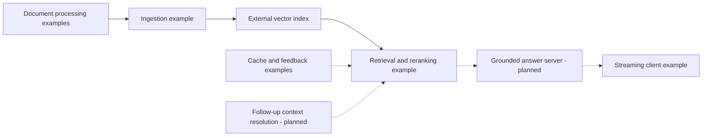

# Applied LLM RAG System

**Scott Allen · AI engineering portfolio**

Finding a document is only part of answering a question. A useful assistant also has to choose the right passage, show where its answer came from, and handle the next question when the user leaves half of it unsaid.

This independent reference project explores those problems through document processing, retrieval, caching, feedback, and streaming chat. It is informed by professional experience with institutional RAG systems. The showcase describes engineering choices in original prose; it is not a reproduction of an employer's production system.

**Current state:** component examples and an audited design. There is no runnable end-to-end chat application yet. Provider integration, retrieval quality, and performance have not been verified. The [feature matrix](docs/FEATURE_STATUS.md) separates the code that exists from the work still needed.

## What this demonstrates

- Preparing varied documents for retrieval, with attention to chunk boundaries and source metadata.
- Combining semantic retrieval with keyword signals for names, acronyms, and exact terms.
- Considering when reranking is worth another model call.
- Examining how feedback and two cache tiers affect answer quality and freshness.
- Designing for the harder conversational case: a follow-up that depends on an earlier question.
- Checking claims against implementation and documenting failures before presenting results.

## Capabilities at a glance

| Area | What is present | What remains |
|---|---|---|
| Document preparation | Python crawling, format extraction, cloud-storage, and mapping examples | Consistent entry points, safe boundaries, extraction tests |
| Ingestion | Chunking, embedding calls, metadata, vector upserts | Reproducible setup, safe dry run, reliable document identity |
| Retrieval | Dense and hashed keyword vectors, filters, conditional reranking | Provider compatibility and retrieval evaluation |
| Cache and feedback | Redis/PostgreSQL operations and source-scoring logic | Cache schema, correctness fixes, contextual isolation, measured impact |
| Streaming | Browser client for cached JSON and SSE responses | Server, accessible interface, protocol and cancellation fixes |
| Custom follow-up chat | Client message history and a session identifier | Server-side context resolution, clarification, fresh evidence, conversation tests |
| Grounding and evaluation | Source metadata and a documented evaluation plan | Answer generation, citation validation, refusal behavior, recorded results |

These are component-level descriptions, not claims of a working integrated service.

## Why follow-up chat deserves its own work

Consider a fictional conversation about travel rules:

> “Who approves an overnight trip?”
>
> “Does that change for part-time staff?”

The second question does not name the trip or the approval rule. The assistant needs to recover that meaning, look for evidence about eligibility, and ask for clarification if the reference is ambiguous. It also needs to recognize when the user has changed subjects.

Caching adds another constraint. The same follow-up wording after a different conversation can require a different answer. A cache keyed only by the latest question can return a plausible answer to the wrong question.

This is a central design topic for the showcase. The existing client supplies a starting point for conversation handling, but the server-side behavior is **not implemented here**. The [design case study](docs/CASE_STUDY.md) explains the challenge and the checks a future independent demonstration should pass.

## Architecture

The diagram shows the intended relationship between existing examples and missing application work. Arrows describe a design, not a verified running pipeline.

Read the [architecture notes](docs/ARCHITECTURE.md) for integration gaps and the proposed conversation boundary.

## Reviewing this checkout

Start with the [feature matrix](docs/FEATURE_STATUS.md), [limitations](docs/LIMITATIONS.md), and [security notes](docs/SECURITY.md). The source directories contain the examples reviewed by the audit; this documentation does not reproduce their code or prompts.

There is currently **no supported local demo command**. The repository has no Node.js package manifest, lockfile, chat server, or automated test suite. Python dependencies are listed in `python/requirements.txt`, but they are not locked and module entry points need repair. Runtime support has not been established through CI.

The previous npm setup and ingestion instructions were not reproducible and have been removed. The existing ingestion `--dry` flag is also not a safe preview: it can still call paid APIs and perform requested remote index operations. Cloud processing can create public shared links. Do not connect these examples to real documents or production services.

[.env.example](.env.example) is a placeholder configuration reference, not working setup instructions. A later approved phase will define a synthetic local demonstration, choose a provider, and supply tested commands.

## Evaluation and results

Retrieval quality, citation correctness, groundedness, follow-up behavior, latency, and API cost are **not yet measured**. No accuracy, speed, or savings claims are made for this checkout.

The [evaluation plan](docs/EVALUATION.md) describes how to record both successful and failed cases, distinguish retrieval from answer quality, and make future results reproducible.

## Project boundaries

Use fictional or explicitly public sample material. Employer documents, application code, internal prompts, credentials, and confidential information do not belong in the showcase. See the [disclaimer and provenance policy](DISCLAIMER.md) and [security reporting policy](SECURITY.md).

No standalone license file is present. The earlier README's MIT label did not establish the provenance of the existing material or supply a complete license. A license decision is deferred pending owner confirmation; this documentation does not grant additional rights.

## Roadmap

The [roadmap](ROADMAP.md) records the scope, status, and completion criteria for all eight phases.

1. Audit the existing repository — complete.
2. Correct documentation and establish an honest showcase — complete.
3. Build a small independent local demonstration.
4. Add the infrastructure needed to reproduce it.
5. Create a fictional corpus, including follow-up and adversarial questions.
6. Run evaluations and publish results with their limitations.
7. Review the implemented security controls and residual risks.
8. Add a verified demonstration screenshot and finish the portfolio presentation.

Phases 3–8 are planned.
