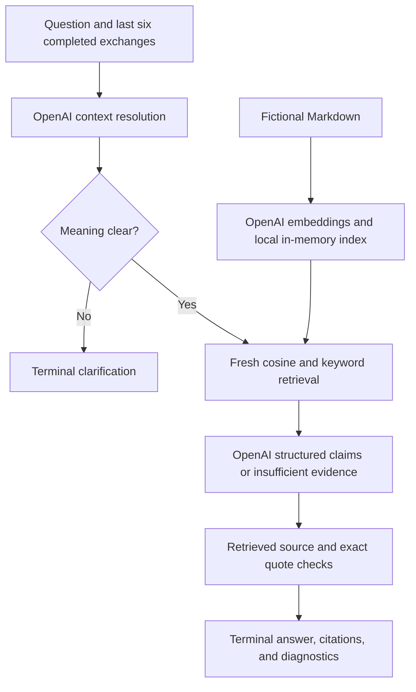
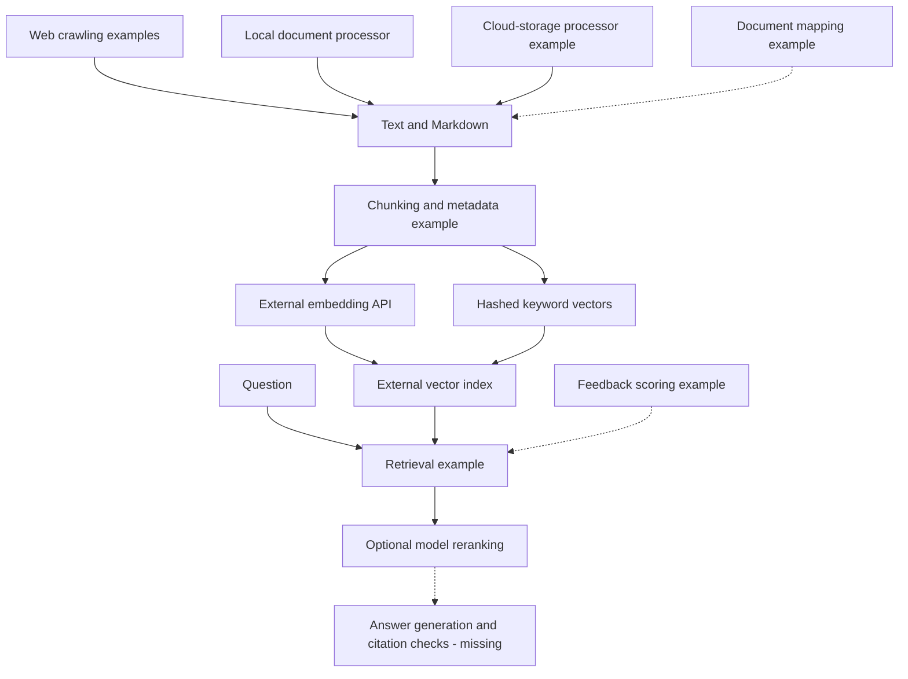
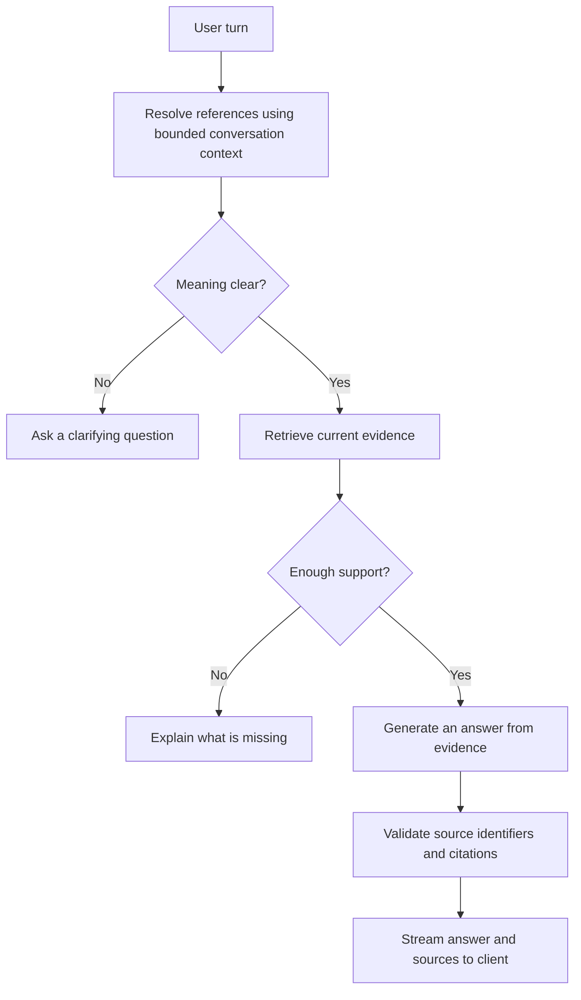

# Architecture

This repository contains an independent Phase 3 terminal demonstration alongside the original component examples for an institutional document assistant. The demo does not import or integrate the legacy `src/` and `python/` modules. Their Phase 1 audit findings remain unchanged.

## Implemented terminal demonstration

`demo/retrieval.mjs` loads heading-based passages capped at 1,800 characters, splitting long lines while preserving exact text and source lines. It embeds the passages at startup and caches normalized vectors and keyword sets. Retrieval combines cosine and distinct keyword-overlap ranks with reciprocal rank fusion to select six passages. Keyword overlap has no inverse document frequency or length normalization; it favors broader query-term coverage and is not BM25.

`demo/provider.mjs` calls OpenAI for embeddings and structured responses, with output limits of 512 tokens for context resolution and 4,096 for answers. It reports recognized incomplete-response causes without exposing raw details and provides rate-or-quota guidance for HTTP 429 without reading error bodies or retrying automatically. The default generation model is GPT-5.6 Terra, with GPT-5.6 Luna selectable via DEMO_MODEL. Both use reasoning effort none and omit temperature; embeddings use text-embedding-3-small. [LOCAL_DEMO.md](LOCAL_DEMO.md) records current model verification separately from historical results.

`demo/chat.mjs` retains at most six completed exchanges, retrieves again for each resolved question, and validates source membership and exact quote text. Citation entries are grouped by source and retain their evidence in `quotes` arrays. Returned claims retain their individual source, quote, and citation number. Those checks do not prove semantic support for a claim.

`demo/cli.mjs` provides interactive and one-question commands; the scenario runner exercises the fictional conversations. Ten focused live checks passed on 2026-09-12; see [LOCAL_DEMO.md](LOCAL_DEMO.md#verification-record). There is no answer cache, persistent index, streaming server, or browser interface in this slice. See [LOCAL_DEMO.md](LOCAL_DEMO.md) for commands, diagnostics, and provider tradeoffs.

The CLI writes answers and citations to stdout and sends its banner, prompts, diagnostics, and errors to stderr. Successful interactive turns clear earlier turn failures from the exit status; piped input retains a nonzero exit status if any turn fails. Scenario checks use source-specific fixture facts and known contradiction patterns, which do not constitute a semantic correctness evaluation. Verification of the PR review changes is recorded separately from the original run in the [demo guide](LOCAL_DEMO.md#pr-review-verification).

## Original document preparation and retrieval

Arrows indicate intended data flow. External services for these original components have not been configured or tested as part of a reproducible checkout. Dashed arrows mark missing or unverified integration.

### Preparation

Python examples cover web requests, sitemap traversal, extraction from modern Office files and PDFs, and fuzzy document matching. Node.js ingestion accepts Markdown, text, and PDFs, splits text with overlap, requests embeddings, and prepares vector records with source metadata.

These examples need consistent invocation, bounded document handling, and reliable failure reporting. A content hash is recorded, but it does not establish duplicate detection. File identity and replacement behavior also need correction before repeated ingestion is reliable.

Cloud processing and authenticated crawling are architectural examples only. The independent synthetic demonstration does not use those processing accounts or real institutional content; it requires an OpenAI API credential for hosted inference.

### Retrieval

The retrieval example creates a dense query vector and a sparse representation based on hashed terms, applies inferred metadata filters, and can request model reranking. Hashed term frequencies are not evidence of a full BM25 implementation.

The provider SDK version, index compatibility, namespace handling, and weighting behavior are unverified. Some default metadata filters disagree with the ingestion categories. A threshold can flag weak retrieval, but there is no answer server that turns that flag into a verified refusal.

## Original browser conversation and response design

The following is a **proposed flow**, not an implemented server:

The client retains messages in memory and persists a session identifier in browser session storage. It sends the current message and session ID. That browser client has no paired server-side history store, reference resolver, or query rewrite. The separate terminal demo implements those conversational decisions in its local process; it does not supply this client integration. Conversation export/import methods do not establish durable server memory.

Follow-up support must distinguish a reference to a previous topic from a new topic, use fresh evidence when the question changes, and keep a prior answer from becoming its own authority. See the [case study](CASE_STUDY.md) for fictional examples and acceptance criteria.

## Original cache boundaries

The cache example looks in Redis before PostgreSQL, then can promote a database hit to Redis. Feedback and curated-entry rules are present, but their correctness and expiry behavior need tests. Cache tables do not have accompanying schema setup.

PostgreSQL lookup uses normalized question text. An optional session suffix on Redis keys does not make the persistent cache conversation-aware. The cache cannot be presented as safe for contextual follow-ups or separate users' restricted evidence.

A future design must establish whether an answer is reusable for the resolved question, relevant conversation context, source revision, and permitted evidence. Until those conditions can be demonstrated, bypassing answer caching for contextual follow-ups is a reasonable proposed default. This remains a design recommendation for the original components. The independent demo omits answer caching entirely.

## Feedback and streaming

Feedback examples classify comments and adjust source scores. They do not train a model, and there is no measured improvement in retrieval or answers. Storage types, initial scoring, and mixed positive/negative comments need correction.

The browser client distinguishes JSON from SSE, receives source information, and exposes update callbacks. It has no paired server or rendered interface. Phase 1 isolated checks found CRLF framing, cancellation-state, and overlapping-request problems. Accessible announcements, focus handling, and safe source rendering remain interface requirements.

## Operational boundary

Evidence for the original components consists of the Phase 1 source inspection and limited offline checks. The independent demo adds offline tests and ten focused live checks that passed on 2026-09-12; see [LOCAL_DEMO.md](LOCAL_DEMO.md#verification-record). There is no integrated health endpoint, application shutdown path, structured tracing, or verified deployment setup. Some components have catches, retries, or timing fields; these are not a system-wide reliability guarantee.

The independent slice selects OpenAI and a local index, pins Node.js 24.21.0, and validates runtime and configuration before embedding documents. Its offline CI commands passed locally; the first hosted workflow run is pending publication. Broader runtime validation, service setup for the original components, and deployment remain future work. [Limitations](LIMITATIONS.md), [security notes](SECURITY.md), and the [roadmap](../ROADMAP.md) describe what remains.
