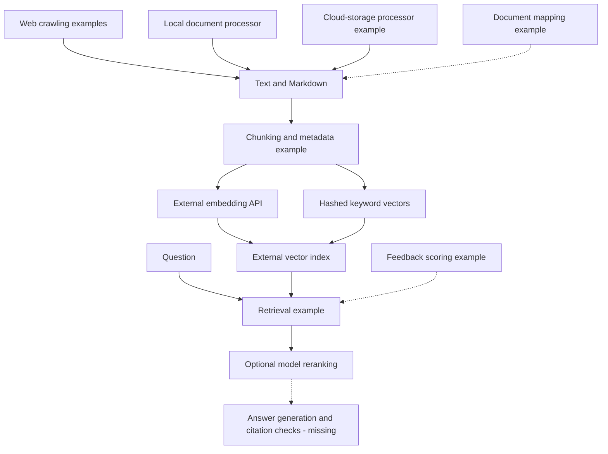
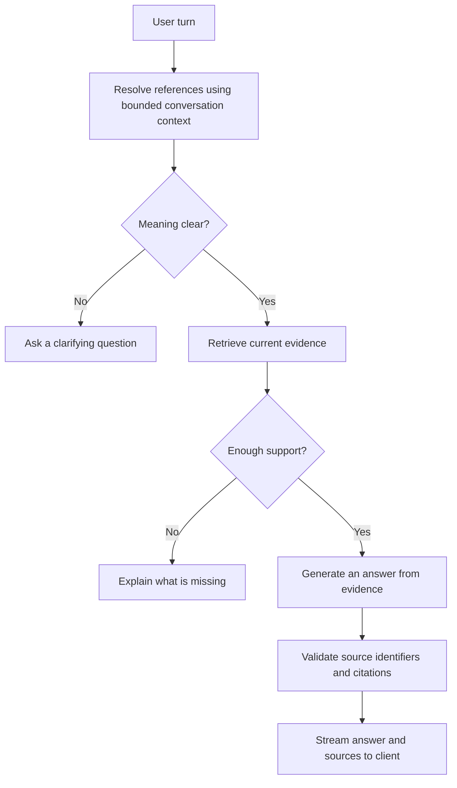

# Architecture

This repository contains component examples for an institutional document assistant. It does not yet connect them into a running application. This document explains the intended relationships and where integration work remains.

## Document preparation and retrieval

Arrows indicate intended data flow. External services have not been configured or tested as part of a reproducible checkout. Dashed arrows mark missing or unverified integration.

### Preparation

Python examples cover web requests, sitemap traversal, extraction from modern Office files and PDFs, and fuzzy document matching. Node.js ingestion accepts Markdown, text, and PDFs, splits text with overlap, requests embeddings, and prepares vector records with source metadata.

These examples need consistent invocation, bounded document handling, and reliable failure reporting. A content hash is recorded, but it does not establish duplicate detection. File identity and replacement behavior also need correction before repeated ingestion is reliable.

Cloud processing and authenticated crawling are architectural examples only. The synthetic demonstration should not require account access or real institutional content.

### Retrieval

The retrieval example creates a dense query vector and a sparse representation based on hashed terms, applies inferred metadata filters, and can request model reranking. Hashed term frequencies are not evidence of a full BM25 implementation.

The provider SDK version, index compatibility, namespace handling, and weighting behavior are unverified. Some default metadata filters disagree with the ingestion categories. A threshold can flag weak retrieval, but there is no answer server that turns that flag into a verified refusal.

## Conversation and response design

The following is a **proposed flow**, not an implemented server:

The client retains messages in memory and persists a session identifier in browser session storage. It sends the current message and session ID. There is no server-side history store, reference resolver, query rewrite, or tested topic-switching behavior in this checkout. Conversation export/import methods do not establish durable server memory.

Follow-up support must distinguish a reference to a previous topic from a new topic, use fresh evidence when the question changes, and keep a prior answer from becoming its own authority. See the [case study](CASE_STUDY.md) for fictional examples and acceptance criteria.

## Cache boundaries

The cache example looks in Redis before PostgreSQL, then can promote a database hit to Redis. Feedback and curated-entry rules are present, but their correctness and expiry behavior need tests. Cache tables do not have accompanying schema setup.

PostgreSQL lookup uses normalized question text. An optional session suffix on Redis keys does not make the persistent cache conversation-aware. The cache cannot be presented as safe for contextual follow-ups or separate users' restricted evidence.

A future design must establish whether an answer is reusable for the resolved question, relevant conversation context, source revision, and permitted evidence. Until those conditions can be demonstrated, bypassing answer caching for contextual follow-ups is a reasonable proposed default. This is a design recommendation, not an implemented control.

## Feedback and streaming

Feedback examples classify comments and adjust source scores. They do not train a model, and there is no measured improvement in retrieval or answers. Storage types, initial scoring, and mixed positive/negative comments need correction.

The browser client distinguishes JSON from SSE, receives source information, and exposes update callbacks. It has no paired server or rendered interface. Phase 1 isolated checks found CRLF framing, cancellation-state, and overlapping-request problems. Accessible announcements, focus handling, and safe source rendering remain interface requirements.

## Operational boundary

Current evidence consists of source inspection and limited offline checks. There is no integrated health endpoint, application shutdown path, structured tracing, or verified deployment setup. Some components have catches, retries, or timing fields; these are not a system-wide reliability guarantee.

Provider selection, supported runtimes, service setup, and an independent runnable slice are future work. [Limitations](LIMITATIONS.md), [security notes](SECURITY.md), and the [roadmap](../ROADMAP.md) describe what remains.
